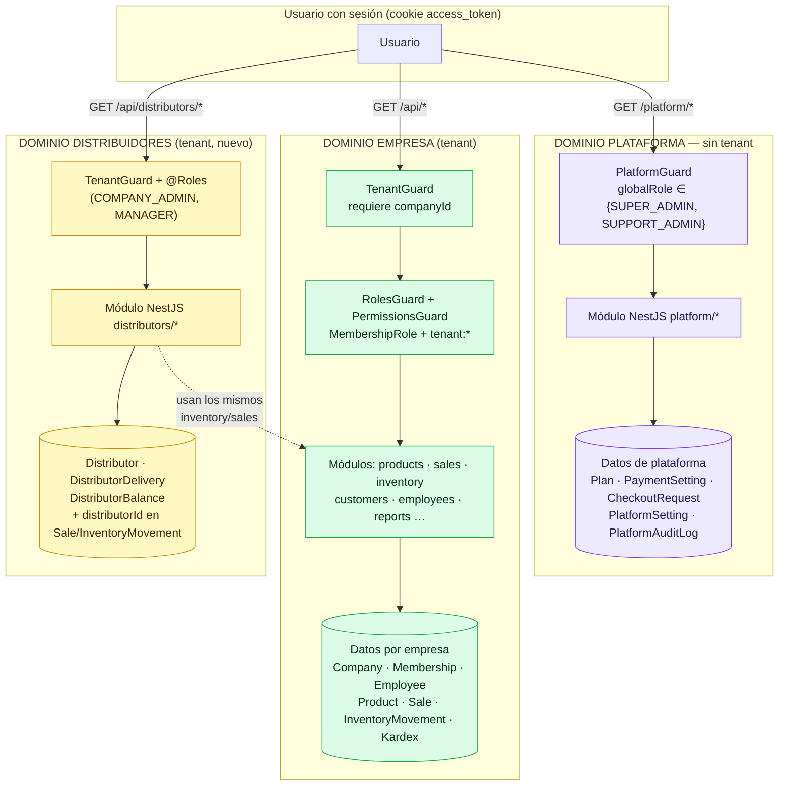
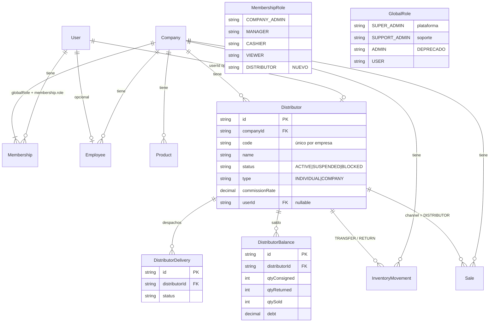
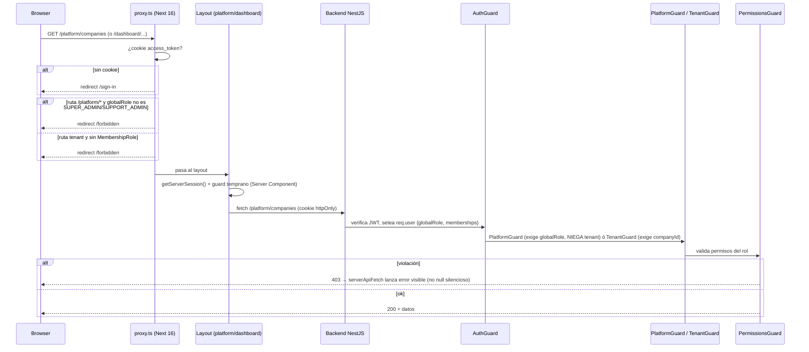
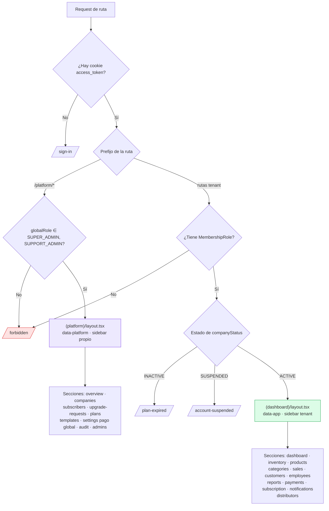
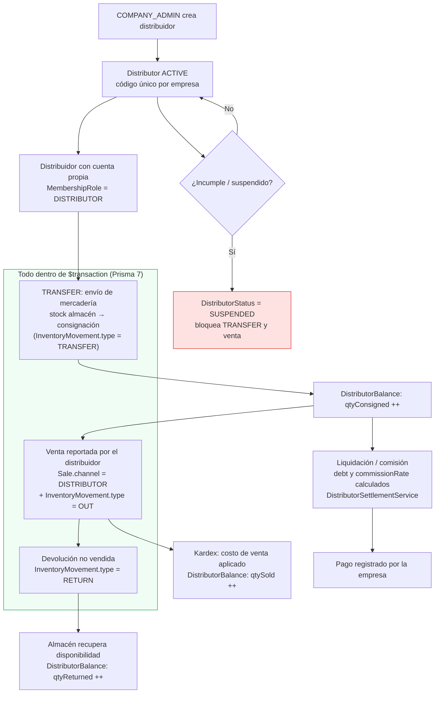
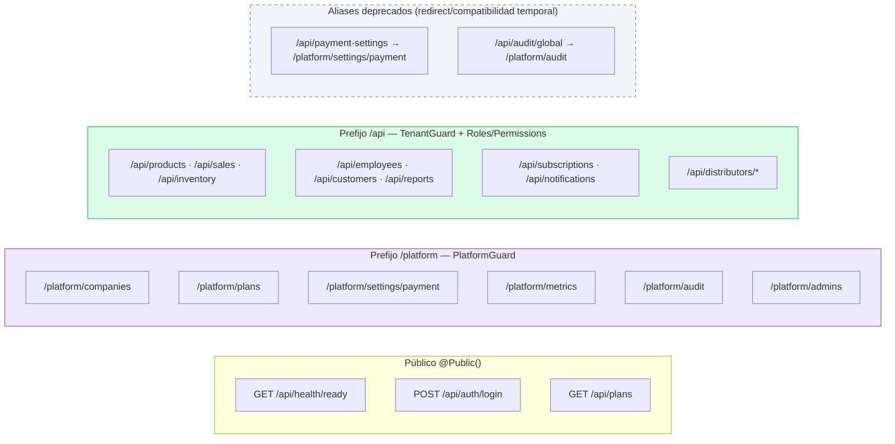
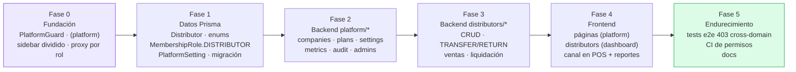
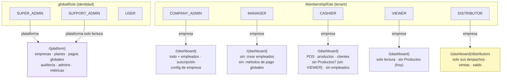

# Diagramas — Estructura de plataforma (SUPER_ADMIN) + Distribuidores

> Hermano de `docs/plan/plan-estructura-superadmin-distribuidores.md`.  
> Diagramas Mermaid (se renderizan en GitHub / VS Code con extensión Mermaid).

---

## D1 — Arquitectura de dominios (3 capas separadas)

---

## D2 — Modelo ER (nuevas tablas y relaciones clave)

> `InventoryMovement.distributorId` y `Sale.distributorId/channel` son columnas **nullable** agregadas a tablas existentes: cero duplicación de fuentes de verdad de stock.

---

## D3 — Flujo de autenticación y autorización (sequence)

---

## D4 — Enrutado por rol en frontend (proxy + guards por página)

---

## D5 — Ciclo de vida del distribuidor y flujo de inventario

---

## D6 — Namespaces de rutas backend (separación observable en red)

---

## D7 — Roadmap de ejecución (fases)

---

## D8 — Mapa de roles → dominio → UI (tabla lógica)

